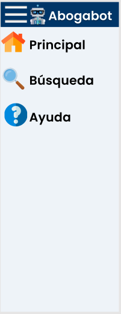
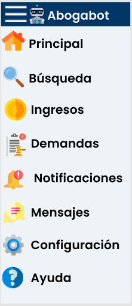
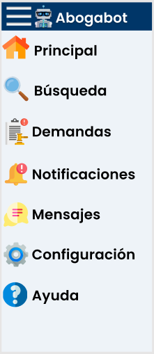

# User Interface

Link de la interface de usuario (UI) creada en la plataforma Figma: https://www.figma.com/file/5k7ip2dX9ZMupz4lHw4mun/Abogabot?node-id=9%3A16

Se diseñaron las siguientes 4 páginas:

- Página principal.
- Dashboard del administrador.
- Vista de la cuenta de usuario.
- Registro de usuarios.

Las cuales pueden también visualizarse en este [archivo PDF](/Images/Abogabot%20UI.pdf).

También se realizaron las siguientes barras de opciones, las cuales no se muestran en el PDF, pero si en el link de FIgma:

- Para Página principal y Registro de usuarios.

- Para Dashboard del administrador.

- Para Vista de la cuenta de usuario.

