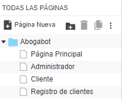
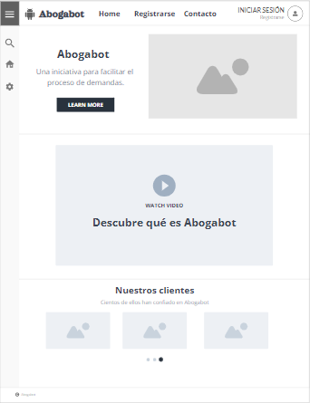
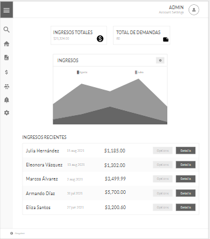
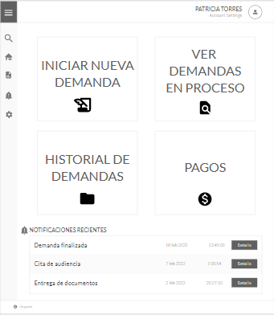
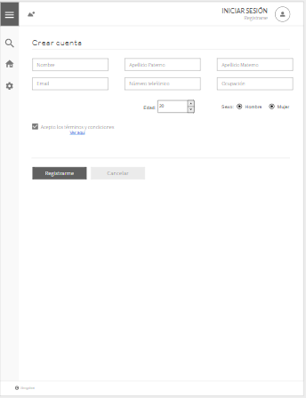

# Wireframe UX

Link de Wireframe de Abogabot creado en la plataforma Moqups: https://app.moqups.com/1biP6NDKtFFdkPHD4cc6h0GT0WG9HyxW/view/page/ae127114a

Se crearon los Wireframes de las siguientes 4 páginas:

- Página principal.

- Dashboard del administrador.

- Vista de la cuenta de usuario.

- Registro de usuarios.

